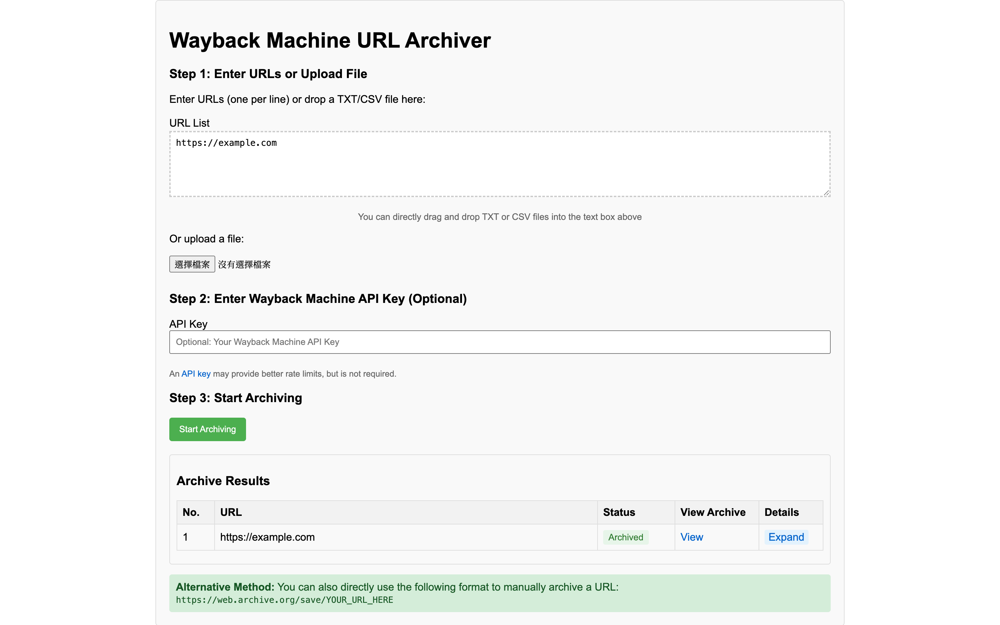

# Wayback Machine URL Archiver

A browser-based tool for batch archiving URLs using the Internet Archive's Wayback Machine.



## Features

- **Batch URL Processing**: Archive multiple URLs at once by entering them manually or uploading a TXT/CSV file
- **Progress Tracking**: Real-time progress bar with estimated time remaining
- **Detailed Status Updates**: View archive status, timestamps, and direct links to archived pages
- **URL Validation**: Automatically validates URLs and detects duplicates
- **Robust Error Handling**: Multiple verification attempts with detailed error reporting
- **Optional API Key Support**: Use your Wayback Machine API key for improved rate limits
- **Drag-and-Drop Support**: Easily upload files by dragging them into the interface

## Getting Started

### Prerequisites

- A modern web browser (Chrome, Firefox, Edge, Safari)
- Internet connection
- Optional: Wayback Machine API key for better rate limits

### Installation

This is a client-side web application that runs entirely in your browser. You can:

1. **Clone the repository**:
   ```
   git clone https://github.com/planetoid/Wayback-Machine-URL-Archiver.git
   ```

2. **Serve the files using a local web server**:
   - Using Python:
     ```
     cd Wayback-Machine-URL-Archiver
     python -m http.server
     ```
   - Using Node.js:
     ```
     cd Wayback-Machine-URL-Archiver
     npx serve
     ```


### Usage

1. **Enter URLs**: Add URLs to archive (one per line) in the text area
   ```
   https://example.com
   https://another-example.com
   ```

2. **Or Upload a File**: Click the file upload button to select a TXT or CSV file containing URLs
   - You can also drag and drop files directly into the text area

3. **Add API Key (Optional)**: Enter your Wayback Machine API key for better rate limits
   - Get an API key from [archive.org/account/s3.php](https://archive.org/account/s3.php)

4. **Start Archiving**: Click the "Start Archiving" button to begin the process

5. **Monitor Progress**: Watch the progress bar and status updates in real-time

6. **View Results**: Click "View Archive" links to see archived pages in the Wayback Machine

## How It Works

The application works by:

1. Parsing and validating the provided URLs
2. Checking if each URL is already archived using the Wayback Machine's availability API
3. Sending archive requests for URLs that aren't already archived
4. Verifying successful archiving through multiple API checks
5. Displaying results with timestamps and direct links to archived pages

## Module Structure

The application follows a modular design pattern:

- `app.js`: Main application class that coordinates all modules
- `waybackAPI.js`: Handles interactions with the Wayback Machine API
- `urlProcessor.js`: Validates and processes URLs
- `fileHandler.js`: Manages file uploads and exports
- `statusTracker.js`: Tracks progress and calculates ETAs
- `uiController.js`: Manages the user interface and updates

## Limitations

- The Wayback Machine has rate limits for archiving requests
- Very large web pages may take longer to archive or fail
- Some websites block archiving via robots.txt
- Recent archives may take time to become visible in the Wayback Machine's index

## License

This project is licensed under the MIT License - see the [[LICENSE]] file for details.

## Acknowledgments

- [Internet Archive](https://archive.org/) for providing the Wayback Machine service

## Privacy Note

This application runs entirely in your browser. No data is sent to any servers other than the official Wayback Machine API. Your URLs and API key are never stored or transmitted elsewhere.
